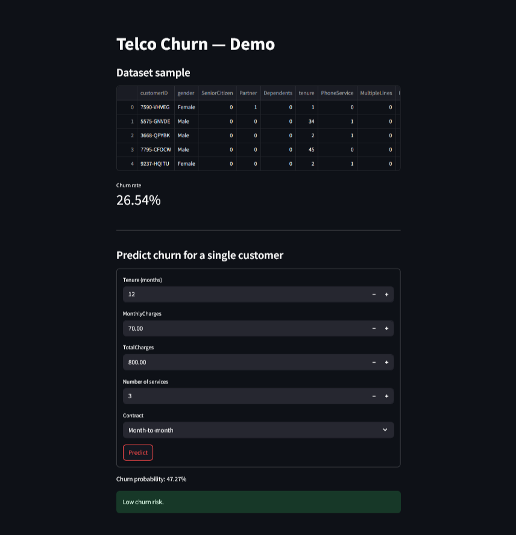
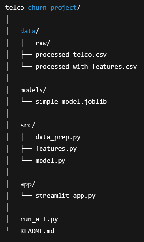

|   TELCO CUSTOMER CHURN PREDICTION — MACHINE LEARNING |
--------------------------------------
A complete, end-to-end machine learning project that predicts whether a telecom customer is likely to churn.
This project covers data cleaning, feature engineering, model training, evaluation, and a simple Streamlit app for interactive predictions.

⭐ Streamlit App Screenshot
--------------------------------------

-----------------------------------------------------------------------------------------------------------------------------------------------------------------------------------------------------------------------------------------

🔍 Overview
--------------------------------------

Customer churn is a major problem in subscription-based businesses. Understanding why customers leave—and predicting who is at risk—is crucial for retention planning.

This project builds a lightweight, interpretable model (Logistic Regression) using the popular Telco Customer Churn dataset. The goal is to keep the workflow simple, transparent, and industry-friendly.

-----------------------------------------------------------------------------------------------------------------------------------------------------------------------------------------------------------------------------------------

🧠 What This Project Demonstrates
--------------------------------------

✔️ Data cleaning & preprocessing
✔️ Feature engineering (e.g., tenure grouping, service counts)
✔️ Train/test split & model evaluation
✔️ Pipeline with scaling + one-hot encoding
✔️ Saving/loading ML models with joblib
✔️ A minimal Streamlit demo app for prediction
✔️ Clean project structure following industry standards

-----------------------------------------------------------------------------------------------------------------------------------------------------------------------------------------------------------------------------------------

🗂️ Project Structure
--------------------------------------

-----------------------------------------------------------------------------------------------------------------------------------------------------------------------------------------------------------------------------------------

📥 Dataset
--------------------------------------

This project uses the Telco Customer Churn dataset from Kaggle.

Place it here before running the pipeline:

data/raw/telco_churn.csv

-----------------------------------------------------------------------------------------------------------------------------------------------------------------------------------------------------------------------------------------

⚙️ Installation
--------------------------------------

git clone <your-repo-url>
cd telco-churn-project

python -m venv venv
source venv/bin/activate      # Windows: venv\Scripts\Activate.ps1

pip install -r requirements.txt

-----------------------------------------------------------------------------------------------------------------------------------------------------------------------------------------------------------------------------------------

🚀 Running the Full Pipeline
--------------------------------------

One command to clean data, engineer features, and train the model:

python run_all.py

Output includes:

cleaned and processed CSVs

trained logistic regression model

model metrics (Accuracy, AUC, Confusion Matrix)

-----------------------------------------------------------------------------------------------------------------------------------------------------------------------------------------------------------------------------------------

🧪 Running the Streamlit App
--------------------------------------

Start the demo app:

streamlit run app/streamlit_app.py

This will open a UI to:

explore data samples

view churn rate

input customer details

get churn probability predictions

-----------------------------------------------------------------------------------------------------------------------------------------------------------------------------------------------------------------------------------------

📈 Model Performance
--------------------------------------

Performance will vary slightly depending on dataset version, but typically:

Accuracy: ~78–82%

AUC: ~82–86%

The model is intentionally simple and explainable.
For production, this pipeline can be extended with more advanced models, hyperparameter optimization, or full MLOps integration.

-----------------------------------------------------------------------------------------------------------------------------------------------------------------------------------------------------------------------------------------

🧩 Key Features
--------------------------------------

Clear, readable code—easy to expand

Modular structure (data_prep, features, model)

Simple, interpretable logistic regression model

Reproducible pipeline with run_all.py

Interactive app for quick demos

-----------------------------------------------------------------------------------------------------------------------------------------------------------------------------------------------------------------------------------------

👤 Author
--------------------------------------

Shankar LR
Machine Learning & Data Science Enthusiast
Bangalore, India
